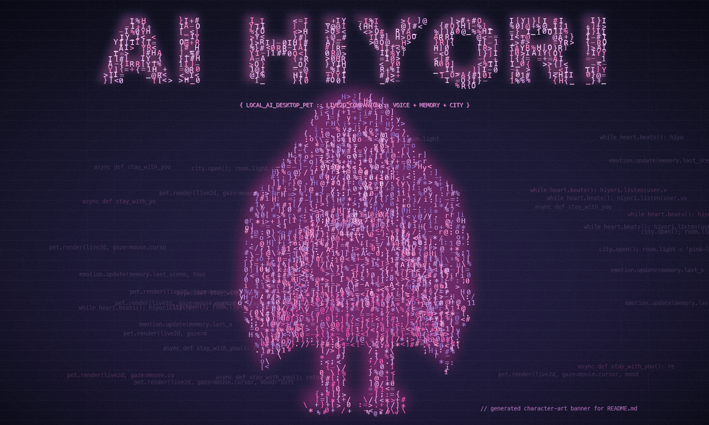
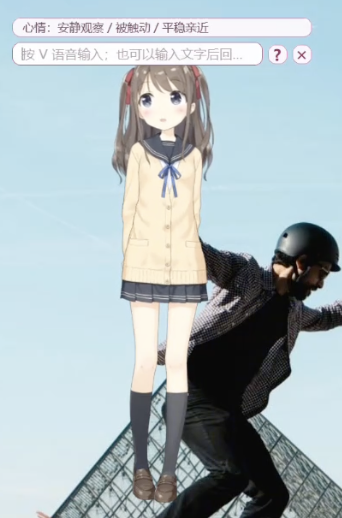

# AI Hiyori Desktop Pet

本地运行的 Live2D AI 桌宠项目。它不是一个单纯聊天窗口，而是一个会停留在桌面上的角色：能对话、听语音、合成语音、记忆互动、主动行为，也有小屋模式、城市地图和一些桌面代理能力。

<p align="center">
  
</p>

<p align="center">
  
</p>

## 这是什么

AI Hiyori Desktop Pet 是一个中文优先的本地桌宠实验项目。目标不是把 AI 塞进一个普通输入框，而是让一个 Live2D 角色长期停留在桌面上，围绕“陪伴、记忆、语音、主动反馈、轻量代理”形成一个可迭代的 AI 角色系统。

核心能力：

- Live2D 桌面角色显示和交互
- 文本对话、语音输入、TTS 语音回复
- 角色心情、身体状态、主动行为
- 长期记忆、事件记忆、关系状态
- 小屋模式、城市地图、道具和轻量玩法
- OCR 截图问答、Browser Agent、本地文件代理等可选能力
- 云端 API、本地 Ollama、本地 TTS / ASR 的分层配置

当前更适合的运行平台：

- Windows
- Python 3.10+
- 能联网访问你配置的模型 / 语音服务

项目目录可以放在任意盘符、任意路径，不要求放在固定目录。仓库内默认只使用相对路径；如果你需要接入外部工具或外部项目，再把那些机器专属路径写到你自己的 `persona_llm_config.json`。

## 一键安装 Prompt

如果你是第一次接触这个项目，不建议先逐条复制固定命令。更推荐把下面这段 Prompt 复制给有终端能力的 AI 助手，例如 Codex、Claude Code、Cursor、ChatGPT Agent 等，让它根据你的电脑环境一步步安装、检查和修复。

```text
请帮我在 Windows 上安装并运行这个 GitHub 项目：
https://github.com/BigWhiteCPN/AI-hirori-desktop-pet

我的目标是先跑通最小可用版本，不要一开始就安装所有扩展能力。

请按下面方式执行：
1. 先检查系统是否适合运行：Windows、Python 3.10+、Git 是否可用。
2. 如果缺少 Python 或 Git，请先告诉我应该安装什么，不要跳过环境检查。
3. 克隆仓库到一个普通英文路径，进入项目目录。
4. 优先运行项目自带的 setup_persona_bot_test.bat。
5. 如果缺少 persona_llm_config.json，请从 persona_llm_config.release.json 复制一份。
6. 引导我配置最小可用的 LLM 设置：
   - 如果我有 DeepSeek API Key，就配置 DEEPSEEK_API_KEY 或 persona_llm_config.json 里的 api_key。
   - 如果我不想用云端 API，就引导我安装 Ollama，并选择本地 Qwen3 4B Instruct。
7. 如果我没有 NVIDIA GPU / CUDA，本地 TTS 先不要强行安装；需要语音合成时优先引导我配置 VOLCENGINE_TTS_API_KEY。
8. 安装完成后运行 run_persona_bot_test.bat。
9. 如果启动失败，先运行 tools/doctor.py 做环境预检，再根据报错解释原因并给我下一步操作。
10. 不要把我的 API Key、persona_llm_config.json、.venv、logs、outputs、third_party 提交到 Git。

请每一步都说明你正在检查什么、为什么这么做；遇到错误时先诊断，不要反复重装全部依赖。
```

不用 AI 助手时，最省事的首次体验路径仍然是：

1. 在 Windows 上下载或克隆仓库
2. 双击 `setup_persona_bot_test.bat`
3. 按提示填写 `persona_llm_config.json`
4. 至少准备 `DEEPSEEK_API_KEY`，或在首次登录界面选择本地 Ollama 模式
5. 如果没有本地 GPU TTS 环境，语音合成优先准备 `VOLCENGINE_TTS_API_KEY`
6. 双击 `run_persona_bot_test.bat`

`setup_persona_bot_test.bat` 会做这些事：

- 创建 `.venv`
- 安装 `requirements_core.txt`
- 如果缺少 `persona_llm_config.json`，就从 `persona_llm_config.release.json` 复制一份
- 运行 `tools/doctor.py` 做环境预检

## 先判断自己适合哪种配置

| 你的条件 | 推荐配置 | 能力范围 |
| --- | --- | --- |
| 只有 API 文本能力 | `DEEPSEEK_API_KEY` | 可用对话主链路；语音相关体验不完整 |
| 想要最稳的首次体验 | `DEEPSEEK_API_KEY` + `VOLCENGINE_TTS_API_KEY` | 对话 + 云端语音合成 |
| 不想用 API | Ollama + `qwen3:4b-instruct` | 本地大模型对话；首次下载较慢 |
| 想用云端语音识别 | 再加 `DOUBAO_ASR_API_KEY` | 自由语音监听 / 云端 ASR |
| 有 NVIDIA GPU + CUDA | 安装本地 TTS / ASR 依赖 | 本地 TTS、本地 ASR |
| 想用聊天截图问答 | 安装 OCR 依赖 + Tesseract | OCR / 聊天截图分析 |
| 想用 browser agent | 安装 browser 依赖 + Chromium | 浏览器代理 |

## 首次配置

默认配置是 API 模式。你可以二选一：

- 在 `persona_llm_config.json` 中填写 `api_key`
- 设置环境变量 `DEEPSEEK_API_KEY`

也可以在首次登录界面选择本地大模型：

- 先安装 Ollama
- 选择“本地 Qwen3 4B Instruct（Ollama）”
- 默认模型是 `qwen3:4b-instruct`
- 默认模型目录是 `third_party/ollama_models`
- 首次启动会检查本机 Ollama，缺少模型时按配置自动执行拉取

如果要使用云端语音服务，再设置：

- `VOLCENGINE_TTS_API_KEY`
- `DOUBAO_ASR_API_KEY`

`.env.example` 里保留了这些环境变量名，便于参考。

## 开发者手动启动

如果你不想走安装脚本，可以手动执行最小核心依赖安装：

```powershell
py -3 -m venv .venv
.\.venv\Scripts\python.exe -m pip install -U pip
.\.venv\Scripts\python.exe -m pip install -r .\requirements_core.txt
Copy-Item .\persona_llm_config.release.json .\persona_llm_config.json
.\.venv\Scripts\python.exe .\tools\doctor.py
.\.venv\Scripts\python.exe .\persona_bot_test.py --profile main
```

说明：

- GitHub 发布场景默认使用 `main` profile
- 首次运行主要读取的是 `persona_llm_config.json`
- 如果你要做多 profile 调试，再显式使用 `--profile test` 或 `PERSONA_RUN_PROFILE=test`

## 依赖分层

最小可运行依赖：

- `requirements_core.txt`

扩展能力依赖：

- `requirements_local_tts.txt`：本地 TTS
- `requirements_local_asr.txt`：本地 ASR
- `requirements_ocr.txt`：OCR Python 依赖
- `requirements_memory.txt`：向量记忆检索
- `requirements_browser_agent.txt`：browser agent
- `requirements_desktop_optional.txt`：桌面凭据存储等可选能力

兼容旧的一次性重安装方式：

- `requirements_runtime.txt`

## 路径规则

为了让别人从 GitHub 下载后更容易使用，仓库现在遵循下面几条规则：

- 文档和脚本优先使用相对路径
- 项目内资源默认相对于仓库根目录解析
- `third_party/...`、`assets/...`、`.\...`、`..\...` 这类配置路径都可以跨电脑迁移
- 外部程序路径，比如 Tesseract、Godot，可留空或写到你自己的本地配置里
- 不要把你机器上的绝对路径提交到 README、模板配置或脚本

## 本地 TTS

项目里的本地 TTS 使用 `faster-qwen3-tts`，底层模型是 Qwen3-TTS。

安装：

```powershell
.\.venv\Scripts\python.exe -m pip install -r .\requirements_local_tts.txt
```

推荐两种写法：

- 远程模型 ID：`Qwen/Qwen3-TTS-12Hz-1.7B-Base`
- 项目内相对路径：`third_party/qwen_tts_model`

如果 `tts_provider = "local"` 且 `qwen_tts_auto_download = true`，程序会在首次启动时检测
`third_party/qwen_tts_model`。目录里没有完整模型时，会自动把
`qwen_tts_model_id` 指定的模型下载到这个目录。

如果你使用项目内默认目录，下面这些字段都可以写相对路径：

- `qwen_tts_model_path`
- `qwen_tts_model_id`
- `qwen_tts_ref_dir`
- `qwen_tts_ref_audio`
- `qwen_tts_ref_text`

默认参考文件位置：

- `third_party/qwen_tts_refs/reference.wav`
- `third_party/qwen_tts_refs/reference.txt`

仓库已经内置一份默认参考音频。想换成自己的声音时，替换这两个文件或在配置里改
`qwen_tts_ref_audio` / `qwen_tts_ref_text`。

本地 TTS 不是零门槛 CPU 模式。通常至少需要：

- Python 3.10+
- PyTorch 2.5.1+
- NVIDIA GPU
- 可用的 CUDA 环境

## 本地语音识别

这个项目的语音识别有两种模式：

- 云端模式：`speech_provider = "doubao"`，默认值，不需要下载本地识别模型
- 本地模式：`speech_provider = "local"`，使用 `FunASR + SenseVoiceSmall`

安装：

```powershell
.\.venv\Scripts\python.exe -m pip install -r .\requirements_local_asr.txt
```

切到本地模式后，模型会在首次使用时自动下载和缓存。

## OCR / 聊天截图问答

Python 依赖：

```powershell
.\.venv\Scripts\python.exe -m pip install -r .\requirements_ocr.txt
```

另外还需要：

- 在 Windows 安装 Tesseract
- 如果自动检测不到，再在 `persona_llm_config.json` 里填写 `tesseract_cmd`

## Browser Agent

浏览器代理不是默认必需项：

```powershell
.\.venv\Scripts\python.exe -m pip install -r .\requirements_browser_agent.txt
.\.venv\Scripts\python.exe -m playwright install chromium
```

## 自检

`tools/doctor.py` 会额外提示这些可选能力是否可用：

- browser agent
- OCR / 截图问答
- keyring 凭据存储
- 本地 TTS
- 本地 ASR

常用命令：

```powershell
.\setup_persona_bot_test.bat
.\run_persona_bot_test.bat
.\.venv\Scripts\python.exe .\tools\doctor.py
.\.venv\Scripts\python.exe .\persona_bot_test.py --profile main
.\.venv\Scripts\python.exe -m compileall persona_bot_test.py persona_pet
```

## 目录说明

- `persona_bot_test.py`：程序入口
- `persona_pet/`：桌宠主要功能模块
- `assets/room/`：小屋背景和布局
- `assets/city_map/`：城市地图资源
- `assets/room_icon/`：小屋图标资源
- `hiyori_pro_zh/`：Live2D 模型资源
- `tools/doctor.py`：环境预检
- `tools/`：本地维护工具

## 键位

- `V` / `F2`：开启自由语音监听
- `N`：关闭自由语音监听
- `C`：聚焦输入框
- `K`：打开/关闭城市地图
- `D`：打开书架
- `B`：打开记忆图谱
- `M`：打开状态面板
- `S` / `F3`：打开 API 设置
- `ESC`：退出程序

## 许可证提醒

仓库目前还没有单独放出顶层 `LICENSE`。原因不是忘了，而是仓库里带了 `hiyori_pro_zh` 这类第三方素材；在给整个仓库落许可证前，需要先确认这些素材的再分发边界和是否要拆分授权说明。

## 不要上传到 GitHub

这些目录或文件是本地运行数据，不应该提交：

- `outputs/`
- `logs/`
- `user_data_backups/`
- `persona_llm_config.json`
- `persona_llm_config.test.json`
- `third_party/`
- `.venv/`

上传前可以检查：

```powershell
git status --short --ignored
```

## 常见问题

- 双击启动脚本报缺环境：先运行 `setup_persona_bot_test.bat`
- 改了 `persona_llm_config.json` 但程序没读到：请确认你是用 `--profile main` 启动
- browser agent 仍然打不开：安装完 Python 包后，再执行 `python -m playwright install chromium`
- 本地 TTS 找不到模型：检查 `qwen_tts_model_path` 是远程模型 ID，还是项目内相对路径
- OCR 不可用：安装 Tesseract，或在配置里填写 `tesseract_cmd`
- Live2D 加载失败：确认 `hiyori_pro_zh/hiyori_pro_zh/runtime/hiyori_pro_t11.model3.json` 存在
